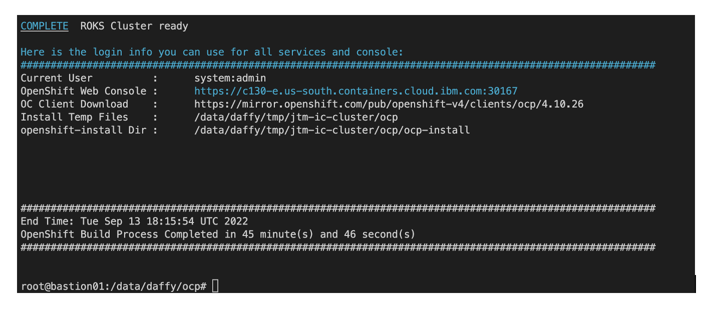
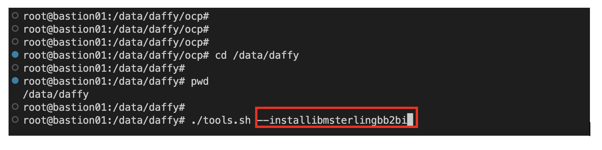
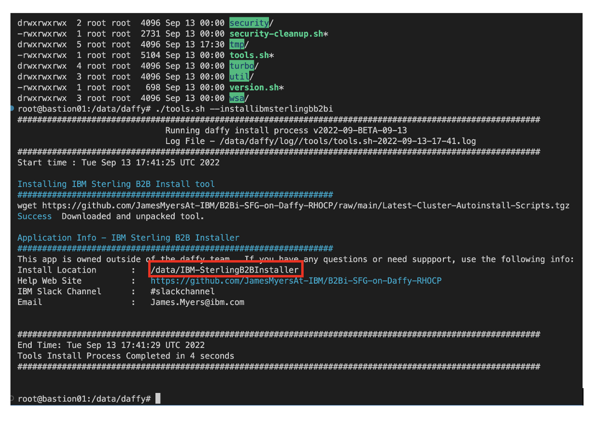
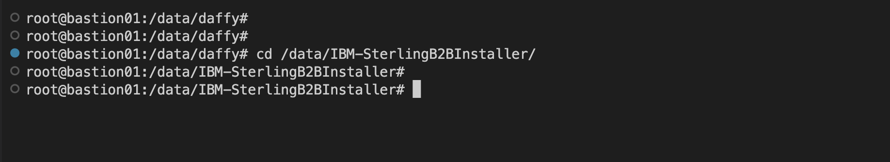

# RHOCP-Daffy-B2Bi

<b>Auto-installation tool for IBM-Sterling B2Bi and IBM-Sterling File Gateway containers in a clustered environment.</b>

This tool was developed to simplify the basic installation of containers for IBM Sterling B2Bi-SFG on RedHat OpenShift Container Platform.

## Basic assumptions / prerequisites:

- You have already installed a ROKS cluster using the [Daffy_RHOCP_Installer](https://ibm.github.io/daffy/).
- You are using a UNIX / Linux bastion host to install and run the scripts.  The bastion host can be located in any cloud (AWS, Azure, GCP, IBM or private).  You may also be able to use your workstation as a bastion host as long as you have the rights to install software on it.
- You have already created a file containing your IBM software entitlement key on the bastion host.  This key will allow access to the IBM B2Bi/SFG software in the IBM Container registry during the final <b>helm</b> install process.
- You already know the ingress subdomain of the cluster where you will be installing this software.  This is available on the cluster dashboard webpage after Daffy installation.  If you are not sure how or where to find this information click [here](ingsub.md).

## Installation:

1. Verify you have a successful installation of your cluster using Daffy. After a successful installation Daffy will display a screen similar to the following:



2. <b>cd</b> to the Daffy home directory and run the CloudPak / Application installer, <b>tools.sh</b>.  Be sure to add the parameter <b>"_--installibmsterlingbb2bi_"</b> to the command:

```bash
root@bastion01:/data/daffy/ocp
root@bastion01:/data/daffy/ocp cd /data/daffy
```
```bash
root@bastion01:/data/daffy/ocp pwd
/data/daffy
```
```
root@bastion01:/data/daffy ./tools.sh --installibmsterlingbb2bi
```


3. Take note of the directory where the B2Bi-SFG installation tool was installed and <b>cd</b> to that directory:



4. <b>cd</b> to the directory:

```bash
root@bastion01:/data/daffy
root@bastion01:/data/daffy cd /data/IBM-SterlingB2BInstaller
```
```bash
root@bastion01:/data/daffy pwd
/data/IBM-SterlingB2BInstaller
```



4. Finally, type this command to begin the installation:

<pre><code><b>./2-install-B2Bi-SFG-cluster.sh</b> <i>AdminEmailAddress</i> <i>ReleaseName</i> <i>NameSpace</i> <i>DB2aaSFlag</i> <i>IngressSubDomain</i> <i>IBM-Entitlement-Key-File</i></code></pre>


#### Where:

| Parameter                   | Description                                                                          |
| :---                        | :---                                                                                 |
| **AdminEmailAddress:**      | *Email address of the cluster administrator.*                                        |
| **ReleaseName:**            |  *Name of the release for this cluster install.*                                     |
| **NameSpace:**              | *A unique namespace prefix for the resources that will be created for this cluster.* |
| **DB2aaSFlag:**             | *Use a DB2 service in a cloud - Y or N.*                                             |
| **IngressSubDomain:**       | *Cluster ingress sub-domain.*                                                        |
| **IBM-Entitlement-Key-File:**| *Full path to a file containing your entitlement key.*


## When the installation has completed you are ready to log in to IBM Sterling B2Bi / File Gateway.<br><br>Congratulations!

#  Notes:

- DB2 as a Service functionality is not available yet.
- If you need to change any environment sizes (add pods, resources, etc.) you may be able to add these resources in OpenShift.  If you require different infrastructure you will need to review the Daffy install process and documentation for the necessary steps.
