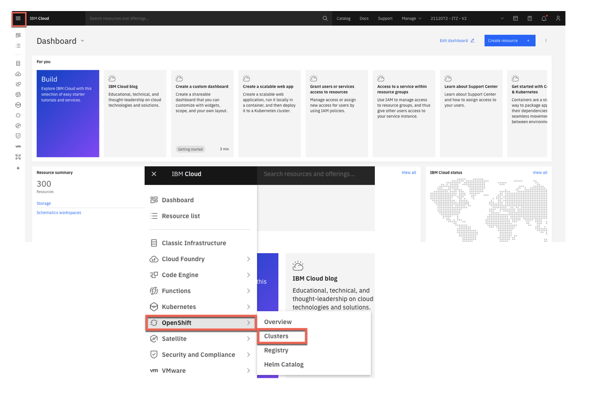
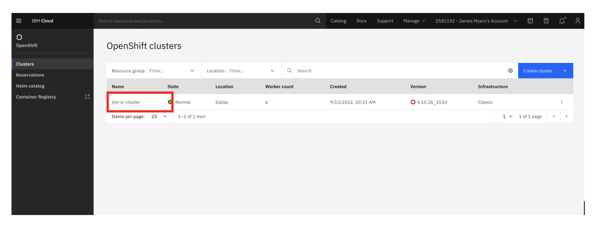
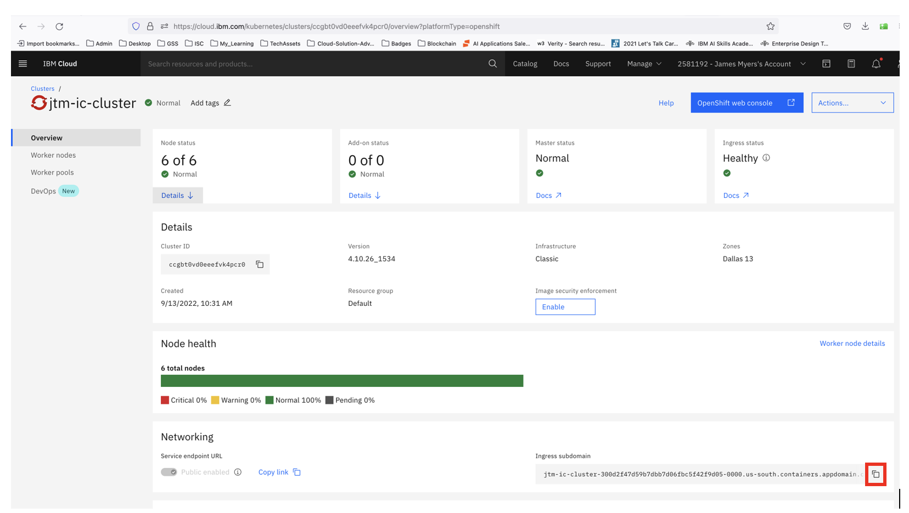

## How to locate the ingress subdomain for your cluster in IBM Cloud

1. Log in to IBM Cloud, then view all of your OpenShift clusters:

2. Click on the cluster you just created:

3. Copy the ingress subdomain to be used in the B2Bi-SFG install command line:

